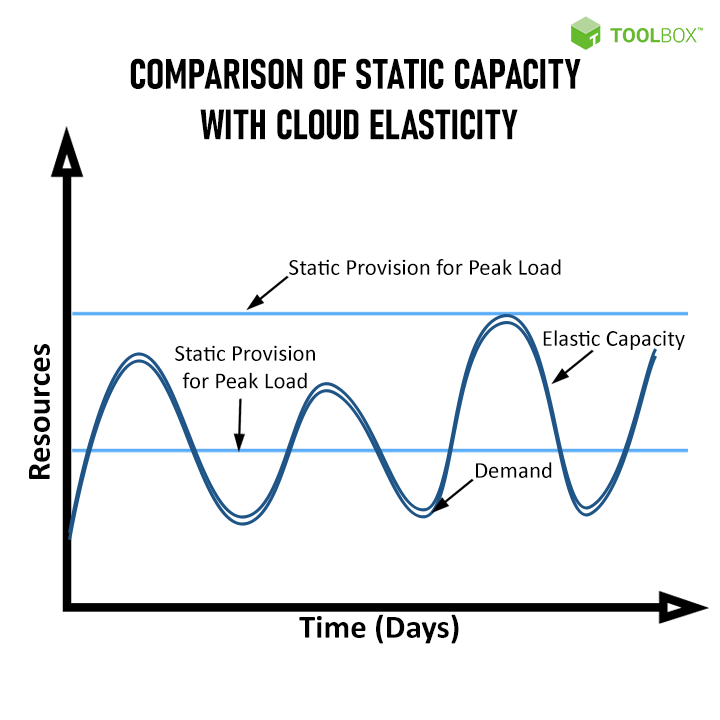

# Actividad 3

##### A. Cuestionario

1. **Motivaciones para la nube**  
   - (a) ¿Qué problemas o limitaciones existían antes del surgimiento de la computación en la nube y cómo los solucionó la centralización de servidores en data centers?
  
   Anteriormente, las empresas y usuarios tenian que costear la adquision de equipos y estos son de alto costo, ademas estas adquisiones eran más de lo que necesitaban o mucho menos. Otro problema era el riesgo a que los equipos tuviera errores. Con la llegada de la nube, permitio adquirir el acceso remoto a bajo costo o dependiendo de la demanda que requiera, ademas que podria ser escalable y flexible.
   
   - (b) ¿Por qué se habla de “The Power Wall” y cómo influyó la aparición de procesadores multi-core en la evolución hacia la nube?

   Se habla de The Power Wall por la limitacion física de los procesadores. Yo puedo tener mi cuarto de computo, con muchos procesadores, pero esto no significa que sea mas eficiente con la gran cantidad de clientes. Podria aumentarle la frecuencia de sus operaciones para las demandas de los clientes, pero esto ocasionaria que se sobrecalentara o hasta que se derritieran, por eso la aparicion de procesadores multi-core influyo en la evolucion de la nube, ya que al tener diferentes nucleos, podria asignar a cada cliente un nucleo y que sus demandas se trabajaran allí, asi evitando aumentar su frecuencia o el sobrecalentamiento.

3. **Clusters y load balancing**  
   - (a) Explica cómo la necesidad de atender grandes volúmenes de tráfico en sitios web condujo a la adopción de clústeres y balanceadores de carga.  

   A medida que los sitios web comienzan a recibir grandes volumenes de usuarios solicitando servicios, funcionalidades, etc, un servidor individual ya no era suficiente ya que generaba lentitud o hasta caidas del sistema, por eso se adopto por un cluster de servidores para mitigar esos problemas, ademas de introducir balanceadores de cargas, permitia que uno de los servidores del cluster no se sobrecargara y sea asignada a otro servidor del cluster
   
   - (b) Describe un ejemplo práctico de cómo un desarrollador de software puede beneficiarse del uso de load balancers para una aplicación web.

   Por ejemplo, yo creo una pagina web donde se pueden visualizar los candidatos presidenciales y congresales, donde estan sus propuestas, denuncias, acciones, etc; y esta web comienza a recibir muchas solicitudes en el dia de elecciones. Asi que para asegurar su funcionamiento inplementamos instancias en diferentes servidores y luego configuramos un load balancers para repartir automaticamente estas solicitudes entre instancias.

4. **Elastic computing**  
   - (a) Define con tus propias palabras el concepto de Elastic Computing.

   La computacion elastica es el aprovisionamiento dinamico de recursos como el almacenamiento, procesamiento, ram, etc de la nube. Esto nos da la ventaja de pagar solamente lo que estamos solicitando, asi evitando la asignacion de recursos menores que ocasiona problemas a nuestros clientes o la asignacion de recursos sobrantes que ocasiona que paguemos mas para recursos que estan inutilizados.

      
   
   - (b) ¿Por qué la virtualización es una pieza clave para la elasticidad en la nube?  
   
   Por que permite crear entornos con los recursos que solamente utilizaremos, sin recursos adicionales que esten inutilizados y evitando gastos innecesarios

   - (c) Menciona un escenario donde, desde la perspectiva de desarrollo, sería muy difícil escalar la infraestructura sin un entorno elástico.
   
   Un escenario, podria ser el mismo escenario de la pregunta anterior (pagina web), cuando sea las elecciones el numero de usuarios se dispararia asi que tedriamos que comprar o alquilar servidores adicionales, ademas no sabemos cuanta demanda seria ocasionando lentitud y caidas de la pagina. En cambio con la comutacion elastica esto se evitaria.

6. **Modelos de servicio (IaaS, PaaS, SaaS, DaaS)**  
   - (a) Diferencia cada uno de estos modelos. ¿En qué casos un desarrollador optaría por PaaS en lugar de IaaS?
   -- **IaaS:** Este servicio ofrese intrastructura, es decir, servidores, almacenamiento, redes, etc. Y  estos servicios lo requieren empresas, profesionales DevOps, etc.
   -- **PaaS:** Este servicio ofrece una plataforma para desarrollar, ejecutar aplicaciones sin necesidad de preocuparse de la infrastructura que tenemos, y esto esta dirigido principalmente a desarrolladores que solamente quieren codigo, sin gestionar servidores
   -- **SaaS:** Este servicio solamente ofrece aplicacions ya listas y solamente para su uso, sin preocuparse de su mantenimiento.
   -- **DaaS:** Este servicio ofrece escritorios virtuales, similar a las maquinas virtuales pero sin preocuparse por los recursos.
     
     Un desarrollador optaria por el PaaS en lugar de IaaS cuando quiera concentrarse solamente en el desarrollo y despliege de su proyecto, sin preocuparse de configurar, mantener una infrastructura (servidores, redes, o bases de datos)
     
   - (b) Enumera tres ejemplos concretos de proveedores o herramientas que correspondan a cada tipo de servicio.
   
   **IaaS:** Amazon EC2, Microsoft Azure Virtual Machines, Google Compute Engine.
	**PaaS:** Google App Engine, Azure app Service, Heroku
	**SaaS:** Microsoft 365, Zoom, google Workspace
	

7. **Tipos de nubes (Pública, Privada, Híbrida, Multi-Cloud)**  
   - (a) ¿Cuáles son las ventajas de implementar una nube privada para una organización grande?  

   - (b) ¿Por qué una empresa podría verse afectada por el “provider lock-in”?  
   
   - (c) ¿Qué rol juegan los “hyperscalers” en el ecosistema de la nube?

#### B. Actividades de investigación y aplicación

1. **Estudio de casos**  
   - Busca dos o tres casos de empresas (startups o grandes organizaciones) que hayan migrado parte de su infraestructura a la nube. Describe:
     1. Sus motivaciones para la migración.  
     2. Los beneficios obtenidos (por ejemplo, reducción de costos, escalabilidad, flexibilidad).  
     3. Los desafíos o dificultades enfrentadas (ej. seguridad, cumplimiento normativo).

2. **Comparativa de modelos de servicio**  
   - Realiza un cuadro comparativo en el que muestres las **responsabilidades** del desarrollador, del proveedor y del equipo de operaciones en los distintos modelos (IaaS, PaaS, SaaS).  
   - Incluye aspectos como: instalación de S.O., despliegue de aplicaciones, escalado automático, parches de seguridad, etc.

3. **Armar una estrategia multi-cloud o híbrida**  
   - Imagina que trabajas en una empresa mediana que tiene una parte de su infraestructura en un data center propio y otra parte en un proveedor de nube pública.  
   - Diseña una estrategia (de forma teórica) para migrar el 50% de tus cargas de trabajo a un segundo proveedor de nube, con el fin de no depender exclusivamente de uno.  
   - Explica dónde iría la base de datos, cómo manejarías la configuración de red y cuál sería el plan de contingencia si un proveedor falla.

4. **Debate sobre costos**  
   - Prepara un breve análisis de los pros y contras de cada tipo de nube (pública, privada, híbrida, multi-cloud) considerando:
     1. Costos iniciales (CAPEX vs. OPEX).  
     2. Flexibilidad y escalabilidad a mediano y largo plazo.  
     3. Cumplimiento con normativas (p.ej. GDPR, HIPAA).  
     4. Barreras o complejidades al cambiar de proveedor.

#### C. Ejercicio de presentación de "mini-proyecto"

Como parte del **aprendizaje práctico**, forma equipos y presenten un **"Mini-proyecto de arquitectura en la nube"**:

1. **Objetivo del sistema**: Cada equipo define brevemente la aplicación o servicio (por ejemplo, un e-commerce, un sistema de reservas, una plataforma de contenido).  
Se desarrollara una página web que conecta a usuarios (alumnos o estudiantes preuniversitarios) con alumnos universitarios o egresados para recibir una orientacion vocacional. Los usuarios podran registrarse, buscar carreras disponibles, reservar sesiones virtuales, recibir automaticamente una reunion agendada por correo con un enlace de una plataforma de videollamadas, y calificar el servicio recibido

2. **Selección de modelo de servicio**: Explica si se utilizará IaaS, PaaS o SaaS, y justifica por qué.  
Se elegiria PaaS ya que solamente necesito enfocarme en el desarrollo de la pagina web, no de la infrastructura, ademas que me permite desplegar mi web y backend de forma sencilla. Tambien se utilizaria SaaS, ya que se integrara servicios como google meet o Zoom, ademas del Gmail API para el envio automatico de correos.

3. **Tipo de nube**: Decide si vas a desplegar la aplicación en una nube pública, privada, híbrida o multi-cloud. Argumenta con un análisis de ventajas y desventajas.  

4. **Esquema de escalabilidad**: Describe cómo la aplicación escalaría en caso de aumento de demanda.  

5. **Costos y riesgos**: Menciona los principales costos (directos o indirectos) y los riesgos asociados a tu elección (p.ej., dependencia del proveedor, requerimientos de seguridad).  
6. **Presentación final**: Prepara un diagrama de alto nivel (físico o lógico) donde se visualice la infraestructura básica y los componentes en la nube.
