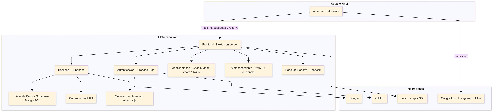

# Actividad 3

### A. Cuestionario

---

**1. Motivaciones para la nube**

- **(a) ¿Qué problemas o limitaciones existían antes del surgimiento de la computación en la nube y cómo los solucionó la centralización de servidores en data centers?**

  *Anteriormente, las empresas y usuarios tenian que costear la adquision de equipos y estos son de alto costo, ademas estas adquisiones eran más de lo que necesitaban o mucho menos. Otro problema era el riesgo a que los equipos tuviera errores. Con la llegada de la nube, permitio adquirir el acceso remoto a bajo costo o dependiendo de la demanda que requiera, ademas que podria ser escalable y flexible.*

- **(b) ¿Por qué se habla de “The Power Wall” y cómo influyó la aparición de procesadores multi-core en la evolución hacia la nube?**

  *Se habla de The Power Wall por la limitacion física de los procesadores. Yo puedo tener mi cuarto de computo, con muchos procesadores, pero esto no significa que sea mas eficiente con la gran cantidad de clientes. Podria aumentarle la frecuencia de sus operaciones para las demandas de los clientes, pero esto ocasionaria que se sobrecalentara o hasta que se derritieran, por eso la aparicion de procesadores multi-core influyo en la evolucion de la nube, ya que al tener diferentes nucleos, podria asignar a cada cliente un nucleo y que sus demandas se trabajaran allí, asi evitando aumentar su frecuencia o el sobrecalentamiento.*

---

**3. Clusters y load balancing**

- **(a) Explica cómo la necesidad de atender grandes volúmenes de tráfico en sitios web condujo a la adopción de clústeres y balanceadores de carga.**

  *A medida que los sitios web comienzan a recibir grandes volumenes de usuarios solicitando servicios, funcionalidades, etc, un servidor individual ya no era suficiente ya que generaba lentitud o hasta caidas del sistema, por eso se adopto por un cluster de servidores para mitigar esos problemas, ademas de introducir balanceadores de cargas, permitia que uno de los servidores del cluster no se sobrecargara y sea asignada a otro servidor del cluster.*

- **(b) Describe un ejemplo práctico de cómo un desarrollador de software puede beneficiarse del uso de load balancers para una aplicación web.**

  *Por ejemplo, yo creo una pagina web donde se pueden visualizar los candidatos presidenciales y congresales, donde estan sus propuestas, denuncias, acciones, etc; y esta web comienza a recibir muchas solicitudes en el dia de elecciones. Asi que para asegurar su funcionamiento inplementamos instancias en diferentes servidores y luego configuramos un load balancers para repartir automaticamente estas solicitudes entre instancias.*

---

**4. Elastic computing**

- **(a) Define con tus propias palabras el concepto de Elastic Computing.**

  *La computacion elastica es el aprovisionamiento dinamico de recursos como el almacenamiento, procesamiento, ram, etc de la nube. Esto nos da la ventaja de pagar solamente lo que estamos solicitando, asi evitando la asignacion de recursos menores que ocasiona problemas a nuestros clientes o la asignacion de recursos sobrantes que ocasiona que paguemos mas para recursos que estan inutilizados.*

  

- **(b) ¿Por qué la virtualización es una pieza clave para la elasticidad en la nube?**

  *Por que permite crear entornos con los recursos que solamente utilizaremos, sin recursos adicionales que esten inutilizados y evitando gastos innecesarios.*

- **(c) Menciona un escenario donde, desde la perspectiva de desarrollo, sería muy difícil escalar la infraestructura sin un entorno elástico.**

  *Un escenario, podria ser el mismo escenario de la pregunta anterior (pagina web), cuando sea las elecciones el numero de usuarios se dispararia asi que tedriamos que comprar o alquilar servidores adicionales, ademas no sabemos cuanta demanda seria ocasionando lentitud y caidas de la pagina. En cambio con la comutacion elastica esto se evitaria.*

---

**6. Modelos de servicio (IaaS, PaaS, SaaS, DaaS)**

- **(a) Diferencia cada uno de estos modelos. ¿En qué casos un desarrollador optaría por PaaS en lugar de IaaS?**

  - **IaaS:** *Este servicio ofrese intrastructura, es decir, servidores, almacenamiento, redes, etc. Y  estos servicios lo requieren empresas, profesionales DevOps, etc.*
  - **PaaS:** *Este servicio ofrece una plataforma para desarrollar, ejecutar aplicaciones sin necesidad de preocuparse de la infrastructura que tenemos, y esto esta dirigido principalmente a desarrolladores que solamente quieren codigo, sin gestionar servidores.*
  - **SaaS:** *Este servicio solamente ofrece aplicacions ya listas y solamente para su uso, sin preocuparse de su mantenimiento.*
  - **DaaS:** *Este servicio ofrece escritorios virtuales, similar a las maquinas virtuales pero sin preocuparse por los recursos.*

  *Un desarrollador optaria por el PaaS en lugar de IaaS cuando quiera concentrarse solamente en el desarrollo y despliege de su proyecto, sin preocuparse de configurar, mantener una infrastructura (servidores, redes, o bases de datos).*

- **(b) Enumera tres ejemplos concretos de proveedores o herramientas que correspondan a cada tipo de servicio.**

  - **IaaS:** Amazon EC2, Microsoft Azure Virtual Machines, Google Compute Engine  
  - **PaaS:** Google App Engine, Azure App Service, Heroku  
  - **SaaS:** Microsoft 365, Zoom, Google Workspace  

---

**8. Tipos de nubes (Pública, Privada, Híbrida, Multi-Cloud)**

- **(a) ¿Cuáles son las ventajas de implementar una nube privada para una organización grande?**

  *Las nubes privadas implementan un mejor control, seguridad y personalización a las nubes, a comparación de una nube pública donde no puedes tener un control total de lo que tienes subido en la nube. La seguridad también es otro punto clave, donde puedes aislar recursos, tener brechas de datos más pequeñas gracias a la privatización de varios recursos.*

- **(b) ¿Por qué una empresa podría verse afectada por el “provider lock-in”?**

  *El "provider lock-in" pasa cuando una empresa solo confia en un proveedor de servicios en la nube. Esto puede ocasionar en que mientras más tiempo pase más costoso será intentar migrar parte de los servicios a diferentes nubes por X o Y motivo, en dado caso pase la migración de datos puede existir una perdida de datos dependiende de la cantidad de datos almacenados en esa única nube. Nuevas tecnologías han sido diseñadas para prevenir a una empresa a esto, y así no ocasionar perdidas innecesarias de datos y dinero.*

- **(c) ¿Qué rol juegan los “hyperscalers” en el ecosistema de la nube?**

  *Su rol en el ecosistema de la nube es proveer recursos informaticos, que sean eficientes y escalables, asi facilitando a empresas grandes o pequeñas acceso a estos equipos sin necesidad de comprar infrastructura propia.*

---

### B. Actividades de investigación y aplicación

---

**1. Estudio de casos**

- **(a) Netflix:** *Tras una falla en su centro de datos en 2008, esta empresa migro a la nube AWS por la urgencia de contar con buena disponibilidad y resilencia. Gracias a esta nube, logro mejorar la experiencia del usuario y acelerar el despliegue de nuevos servicios, aunque tuvo que rediseñar sus sistemas para adaptarlo a la nube.*

- **(b) Spotify:** *Esta empresa decidio migrar a Google Cloud Plataform para mejorar sus productos/servicios y dejar de lado la gestion propia de infrastructura. Obtuvo mayor eficiencia, escalabilidad y acceso a herramientas de analisis de datos, aunque en la migracion tuvo que asumir gastos de capacitación.*

---

**2. Comparativa de modelos de servicio**

| **Aspecto**                   | **IaaS**                                     | **PaaS**                                      | **SaaS**                                   |
|------------------------------|----------------------------------------------|----------------------------------------------|--------------------------------------------|
| **Mantenimiento del S.O.**   | Usuario (Operaciones/DevOps)                | Proveedor                                    | Proveedor                                  |
| **Despliegue de aplicaciones** | Desarrollador / Operaciones               | Desarrollador                                | Proveedor                                  |
| **Gestión de la red**        | Usuario (Operaciones/DevOps)                | Proveedor                                    | Proveedor                                  |
| **Escalado automático**      | Usuario configura, proveedor provee infra   | Proveedor (configurable por el usuario)      | Proveedor                                  |
| **Escalabilidad**            | Manual / automatizable por el usuario       | Gestionada por el proveedor (autoescalado)   | Transparente para el usuario               |

---

**3. Armar una estrategia multi-cloud o híbrida**

- *Imagina que trabajas en una empresa mediana que tiene una parte de su infraestructura en un data center propio y otra parte en un proveedor de nube pública.*  
- *Diseña una estrategia (de forma teórica) para migrar el 50% de tus cargas de trabajo a un segundo proveedor de nube, con el fin de no depender exclusivamente de uno.*  
- *Explica dónde iría la base de datos, cómo manejarías la configuración de red y cuál sería el plan de contingencia si un proveedor falla.*

---

**4. Debate sobre costos**

#### Nube Pública
- **Costos:** *OPEX. Sin grandes inversiones iniciales.*  
- **Flexibilidad:** *Muy alta. Escalabilidad casi inmediata.*  
- **Cumplimiento:** *Puede ser complejo si no se elige bien el proveedor.*  
- **Cambio de proveedor:** *Difícil por dependencia de servicios propietarios.*

#### Nube Privada
- **Costos:** *CAPEX alto. Requiere hardware propio o dedicado.*  
- **Flexibilidad:** *Limitada por la infraestructura instalada.*  
- **Cumplimiento:** *Alta, más fácil controlar datos y procesos.*  
- **Cambio de proveedor:** *Bajo impacto, si es on-premise.*

#### Nube Híbrida
- **Costos:** *Combinación de CAPEX y OPEX.*  
- **Flexibilidad:** *Buena, se aprovecha lo mejor de ambos mundos.*  
- **Cumplimiento:** *Alta, datos sensibles en nube privada.*  
- **Cambio de proveedor:** *Complejo por la integración entre nubes.*

#### Multi-cloud
- **Costos:** *OPEX. Posiblemente más alto por duplicidad de servicios.*  
- **Flexibilidad:** *Excelente. Se evita la dependencia de un solo proveedor.*  
- **Cumplimiento:** *Alto, si se elige cada proveedor por fortaleza específica.*  
- **Cambio de proveedor:** *Menor impacto, ya hay experiencia multilateral.*

---

### C. Ejercicio de presentación de "mini-proyecto"

Como parte del *aprendizaje práctico*, forma equipos y presenten un **"Mini-proyecto de arquitectura en la nube"**:

- **Objetivo del sistema:**  

  *Se desarrollara una página web que conecta a usuarios (alumnos o estudiantes preuniversitarios) con alumnos universitarios o egresados para recibir una orientacion vocacional. Los usuarios podran registrarse, buscar carreras disponibles, reservar sesiones virtuales, recibir automaticamente una reunion agendada por correo con un enlace de una plataforma de videollamadas, y calificar el servicio recibido*

- **Seleccion de modelo de servicio**
  
  *Se elegiria PaaS ya que solamente necesito enfocarme en el desarrollo de la pagina web, no de la infrastructura, ademas que me permite desplegar mi web y backend de forma sencilla. Tambien se utilizaria SaaS, ya que se integrara servicios como google meet o Zoom, ademas del Gmail API para el envio automatico de correos.*

- **Tipo de nube**

  *Haremos uso de una nube pública, ya que nos brinda recursos (servidores, almacenamiento, etc.) ya gestionados por el proveedor externo, por lo que se nos hace más sencillo trabajar desde ese tipo de nube.*

  -**El proyecto necesita:**
  
  1. *Alta disponibilidad, para que los estudiantes puedan entrar en cualquier momento.*
  2. *Bajos costos, ya que al ser un proyecto pequeño no se contará con un presupuesto alto.*
  3. *Escalabilidad automática para su adaptación dependiendo de la cantidad de usuarios.*
  4. *Mantenimientos mínimos de los servidores, ya que el grupo debe enfocarse en la lógica del sistema.*

  -**Opciones:**
  
  1. *Heroku: Ideal para novatos y si es que se quiere publicar rápido una API o app sencilla. Muy amigable.*
  2. *Vercel: Perfecto para interfaces en React/Next.js. Es rápido y no se dificulta.*
  3. *Supabase: Se usa si se busca un backend robusto con una base de datos real. Perfecto para apps con un sistema de usuarios.*
  4. *Firebase: Perfecto para aplicaciones donde se necesita tiempo real, como chats o dashboards colaborativos. Tiene todo incluido para frontend y apps móviles.*
    
  -**Recomendación:**
  
  1. *Frontend: Vercel + Next.js*
  2. *Backend: Supabase, funciones integradas*
  3. *Chat/Reuniones: Firebase*
  4. *Base de datos: Supabase*       

- **Tipo de nube**

  *Haremos uso de una nube pública, ya que nos brinda recursos (servidores, almacenamiento, etc.) ya gestionados por el proveedor externo, por lo que se nos hace más sencillo trabajar desde ese tipo de nube.*

- **Esquema de escalabilidad:**
  
  *Según las recomendaciones, ya estamos usando servicios en la nube (Vercel, Supabasem Firebase), ya que se ajustan automáticamente dependiendo de la demanda.*
  
  - *Vercel: escala automáticamente, si el tráfico es demasiado alto, se puede optar por planes de pago que nos ayuden.*
  - *Supabase (backend): escala automáticamente, separa funciones críticas y mejora la eficiencia de las consultas.*
  - *Supabase (base de datos): Escala verticalmente.*
  - *Firebase: Escala sin esfuerzo, si el tráfico es bastante, es recomendable pasar a Firestore o usar reglas de seguridad eficientes.*
  - *Supabase (autenticación): Se maneja sin complicaciones. Si la demanda es demasiada, se puede usar proveedores externos, como Google o GitHub, para balancear cargas.*

- **Costos (directos o indirectos) y riesgos asociados**

  1. **Costos directos**

  - **Hosting en la nube:** *Se podría usar **Amazon Web Services (AWS)** para alojar la aplicación. Esto incluye EC2 para servidores, RDS para bases de datos y S3 para almacenamiento de archivos.*
  - **Videollamadas:** *Se puede integrar **Twilio Video**, que cobra aproximadamente $0.004 por minuto por participante. Es estable, confiable y permite integración sencilla con la web.*
  - **Certificados SSL:** *Con **Let’s Encrypt** se puede obtener certificados SSL gratuitos, con posibilidad de migrar a certificados de pago si se requieren garantías adicionales.*
  - **Autenticación:** *Con **Firebase Authentication**, base de datos gratuito que permite autenticación con correo, Google, entre otros.*

  2. **Costos Indirectos**

  - **Marketing y adquisición de usuarios:** *Habrá inversión en campañas de **Google Ads** y promoción en redes sociales como **Instagram y TikTok**.*
  - **Soporte técnico:** *Se contratará personal para resolver dudas de alumnos y universitarios vía **Zendesk** o correo electrónico.*
  - **Capacitación a mentores:** *Se desarrollarán materiales como videos y guías para los mentores, en conjunto con talleres virtuales via **Google Meet**. El costo será variable, dependiendo del alcance.*
  - **Moderación de contenido:** *Se implementará un sistema de revisión manual y automático de perfiles y calificaciones.*

  4. **Riesgos asociados**

  - **Poca adopción inicial:** *Si no logramos atraer a suficientes usuarios, la plataforma podría parecer vacía y desincentivar su uso. Por lo que se tratará de mitigar con campañas agresivas de difusión y posibles alianzas con diferentes colegios.*
  - **Malas experiencias:** *Un universitario puede dar una mala charla o tener un comportamiento inapropiado, por eso se tiene un sistema de reporte y moderación activa, con posibilidad de expulsión inmediata.*
  - **Sobrecarga de infraestructura:** *Si la plataforma recibe muchos usuarios de golpe, los servidores podrían colapsar. Para evitar esto, se podría hacer un **autoscaling** en AWS y realizar pruebas de carga periódicas.*

- **Diagrama visualizador:**
  
  

  
