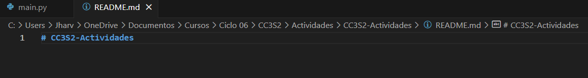

#### Ejercicios

##### Ejercicio 1: Manejo avanzado de ramas y resolución de conflictos

**Objetivo:** Practicar la creación, fusión y eliminación de ramas, así como la resolución de conflictos que puedan surgir durante la fusión.

1. **Crear una nueva rama para una característica:**
   - Creamos una nueva rama llamada `feature/advanced-feature` desde la rama `main`:

    

2. **Modificar archivos en la nueva rama:**
   - Editamos el archivo `main.py` para incluir una función adicional:
     ```python
     def greet():
         print('Hello from advanced feature')

     greet()
     ```
   - Añadimos y confirmamos estos cambios en la rama `feature/advanced-feature`:

    

3. **Simular un desarrollo paralelo en la rama main:**
   - Cambiamos de nuevo a la rama `main` con el siguiente comando:

     ```bash
     $ git checkout main
     ```
   - Editamos el archivo `main.py` de forma diferente (por ejemplo, cambia el mensaje del print original):
     ```python
     print('Hello World - updated in main')
     ```
   - Añadimos y confirmamos estos cambios en la rama `main`:

     ```bash
     $ git add main.py
     $ git commit -m "Actualizacion del mensaje de main.py en la rama main"
     ```

4. **Intentar fusionar la rama feature/advanced-feature en main:**
   - Fusionamos la rama `feature/advanced-feature` en `main`:

    

5. **Resolver el conflicto de fusión y eliminar rama fusionada:**
   - Git generará un conflicto en `main.py`. Abre el archivo y resuelve el conflicto manualmente, elegimo combinar las dos versiones.

    

   - Después de resolver el conflicto, añade el archivo resuelto y completa la fusión, ademas eliminamos la rama:

     


#### Ejercicio 2: Exploración y manipulación del historial de commits

**Objetivo:** Aprender a navegar y manipular el historial de commits usando comandos avanzados de Git.

1. **Ver el historial detallado de commits:**
   - Usa el comando `git log` para explorar el historial de commits, pero esta vez con más detalle:

     ```bash
     $ git log -p
     ```
    

   - Examina las diferencias introducidas en cada commit. ¿Qué cambios fueron realizados en cada uno?

    Una diferencia notoria es en los hash'es de cada commit, difieren en todos sus caracteres. Ademas los cambios realizados fueron lo que hicimos al main.py para el ejercicio anterior. Otra diferencia, no tan importante es en la fecha que se hizo el commit.

2. **Filtrar commits por autor:**
   - Usamos el siguiente comando para mostrar solo los commits realizados por un autor, en este caso Jharvy:

     ```bash
     $ git log --author="Jharvy"
     ```
    

3. **Revertir un commit:**
   - Imagina que el commit más reciente en `main.py` no debería haberse hecho. Usa `git revert` para revertir ese commit:

     ```bash
     $ git revert HEAD
     ```
   - Verifica que el commit de reversión ha sido añadido correctamente al historial.

    Agregue algunos comentarios en `main.py` para ejecutar el comando y se pueda visualizar mejor.

    

4. **Rebase interactivo:**
   - Usa el siguiente comando para empezar el rebase interactivo:

     ```bash
     $ git rebase -i HEAD~3
     ```
   - En el editor que se abre, combina los últimos tres commits en uno solo utilizando la opción `squash`.

    

    Despues de hacer el rebase, tenemos:

    

5. **Visualización gráfica del historial:**
   - Usamos el siguiente comando para ver una representación gráfica del historial de commits:

    

   - Reflexiona sobre cómo el historial de tu proyecto se visualiza en este formato. ¿Qué información adicional puedes inferir?

   Se visualiza de forma cronologica y de forma estructurada, util para tener conocimiento del trabajo paralelo o de como ha evolucionado el proyecto. Una informacion que se puede inferir es que rama se a trabajado más. Posibles ramas con errores potenciales.


#### Ejercicio 3: Creación y gestión de ramas desde commits específicos

**Objetivo:** Practicar la creación de ramas desde commits específicos y comprender cómo Git maneja las referencias históricas.

1. **Crear una nueva rama desde un commit específico:**
   - Usamos el historial de commits (`git log --oneline`) para identificar un commit antiguo desde el cual crear una nueva rama:

     ```bash
     $ git log --oneline
     ```
   - Creamos una nueva rama `bugfix/rollback-feature` desde ese commit:

    
    
2. **Modificar y confirmar cambios en la nueva rama:**
   - Realizamos algunas modificaciones en `main.py` que simulen una corrección de errores:
     ```python
     def greet():
         print('Fixed bug in feature')
     ```
   - Añadimos y confirma los cambios en la nueva rama:

    

3. **Fusionar los cambios en la rama principal:**
   - Cambia de nuevo a la rama `main` y fusiona la rama `bugfix/rollback-feature`:

    

4. **Explorar el historial después de la fusión:**
   - Usa `git log` y `git log --graph` para ver cómo se ha integrado el commit en el historial:

    

5. **Eliminar la rama bugfix/rollback-feature:**
   - Una vez fusionados los cambios, eliminamos la rama `bugfix/rollback-feature`:

    


#### Ejercicio 4: Manipulación y restauración de commits con git reset y git restore

**Objetivo:** Comprender cómo usar `git reset` y `git restore` para deshacer cambios en el historial y en el área de trabajo.

1. **Hacer cambios en el archivo main.py:**
   - Editamos el archivo `main.py` para introducir un nuevo cambio:
     ```python
     print('This change will be reset')
     ```
   - Añade y confirma los cambios:

    

2. **Usar git reset para deshacer el commit:**
   - Deshaz el commit utilizando `git reset` para volver al estado anterior:

     ```bash
     $ git reset --hard HEAD~1
     ```
   - Verifica que el commit ha sido eliminado del historial y que el archivo ha vuelto a su estado anterior.

    

3. **Usar git restore para deshacer cambios no confirmados:**
   - Realiza un cambio en `README.md` y no lo confirmes:

     ```bash
     $ echo "Another line in README" >> README.md
     $ git status
     ```

    

   - Usa `git restore` para deshacer este cambio no confirmado:

     ```bash
     $ git restore README.md
     ```
   - Verifica que el cambio no confirmado ha sido revertido.

    


#### Ejercicio 5: Trabajo colaborativo y manejo de Pull Requests

**Objetivo:** Simular un flujo de trabajo colaborativo utilizando ramas y pull requests.

1. **Crear un nuevo repositorio remoto:**
   - Usa GitHub o GitLab para crear un nuevo repositorio remoto y clónalo localmente con:

     ```bash
     $ git clone <URL-del-repositorio>
     ```

    En este caso ya lo tenia clonado, asi que omitimos esta parte.

2. **Crear una nueva rama para desarrollo de una característica:**
   - En tu repositorio local, crea una nueva rama `feature/team-feature`:

    

3. **Realizar cambios y enviar la rama al repositorio remoto:**
   - Realizamos cambios en los archivos del proyecto y confírmalos:

     ```bash
     $ echo "print('Collaboration is key!')" > collaboration.py
     $ git add .
     $ git commit -m "Add collaboration script"
     ```
   - Envíamos la rama al repositorio remoto:

     ```bash
     $ git push origin feature/team-feature
     ```

    


4. **Abrir un Pull Request:**
   - Abre un Pull Request (PR) en la plataforma remota (GitHub/GitLab) para fusionar `feature/team-feature` con la rama `main`.
   - Añade una descripción detallada del PR, explicando los cambios realizados y su propósito.
    


5. **Revisar y fusionar el Pull Request:**
   - Simula la revisión de código, comenta en el PR y realiza cualquier cambio necesario basado en la retroalimentación.
   - Una vez aprobado, fusiona el PR en la rama `main`.
    

6. **Eliminar la rama remota y local:**
   - Después de la fusión, eliminaMOS la rama tanto local como remotamente:
    
    

#### Ejercicio 6: Cherry-Picking y Git Stash

**Objetivo:** Aprender a aplicar commits específicos a otra rama utilizando `git cherry-pick` y a guardar temporalmente cambios no confirmados utilizando `git stash`.

**Instrucciones:**

1. **Hacer cambios en main.py y confirmarlos:**
   - Realizamos y confirmamos varios cambios en `main.py` en la rama `main`:
    
    

2. **Crear una nueva rama y aplicar el commit específico:**
   - Crea una nueva rama `feature/cherry-pick` y aplícale el commit específico:

     ```bash
     $ git branch feature/cherry-pick
     $ git checkout feature/cherry-pick
     $ git cherry-pick <commit-hash>
    ```
  


3. **Guardar temporalmente cambios no confirmados:**
   - Realiza algunos cambios en `main.py` pero no los confirmamos, y ademas guardamos temporalmente con el comando `git stash`:

    

4. **Aplicar los cambios guardados:**
   - Realiza otros cambios y confírmalos si es necesario.

    

   - Luego, recuperaMOS los cambios guardados anteriormente:

     

5. **Revisar el historial y confirmar la correcta aplicación de los cambios:**

   - UsaMOS `git log` para revisar el historial de commits y verificar que todos los cambios se han aplicado correctamente.

    